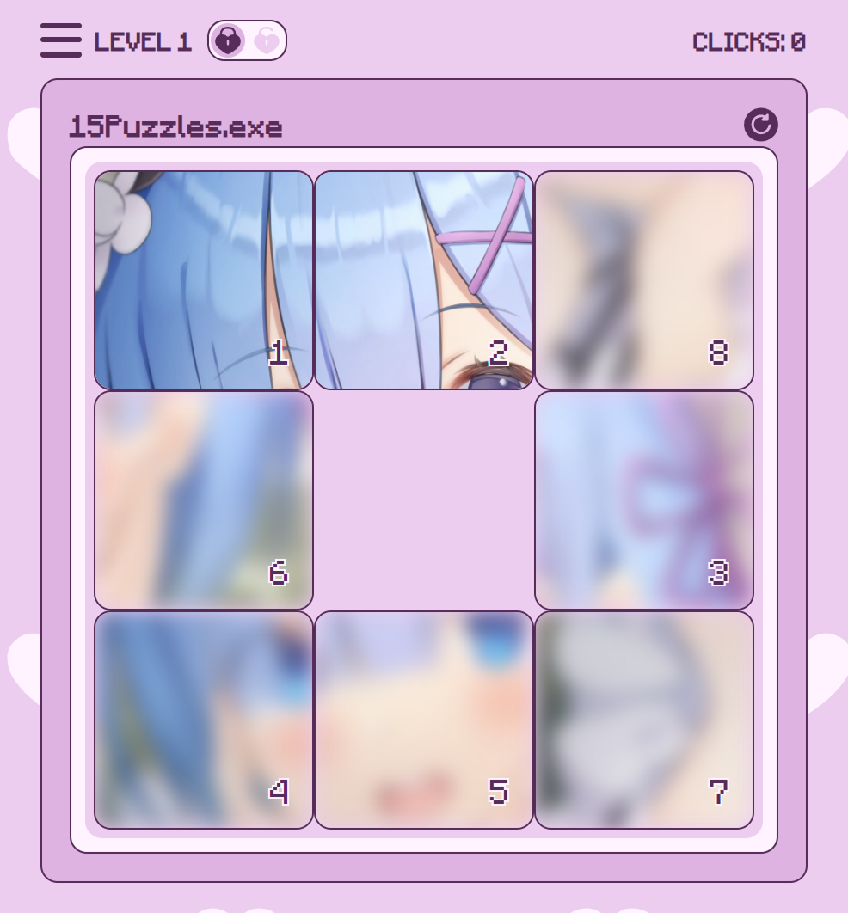
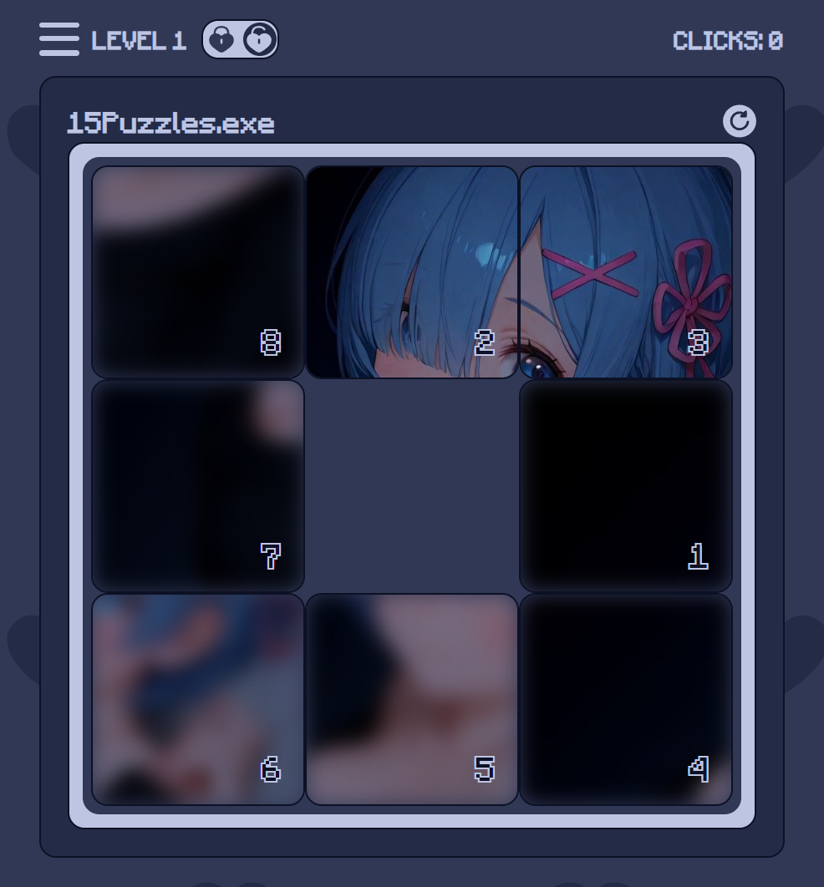

# ♡ Пятнашки (игра в 15, такен) на ванильном JS+HTML+CSS ♡

Реализация головоломки «Пятнашки» без использования фреймворков.

## Описание

Игра представляет собой поле с пронумерованными плитками и одной пустой ячейкой. Цель — упорядочить плитки по возрастанию, перемещая их по полю. Правильный порядок плиток образует картинку.

- Реализация без библиотек;
- Алгоритм проверки перемешанной позиции плиток на решаемость;
- Выбор различных тем картинок в зависимости от режима (PG-13 и NC-17);
- Выбор уровней в рамках темы;
- Счетчик кликов;
- Сохранение прогресса в локальном хранилище;
- Адаптивный дизайн.

## Технологии

- HTML5;
- CSS3;
- JavaScript ES6+.

## Скриншоты

| PG-13 режим | NC-17 режим |
|------------|-------------|
|  |  |

